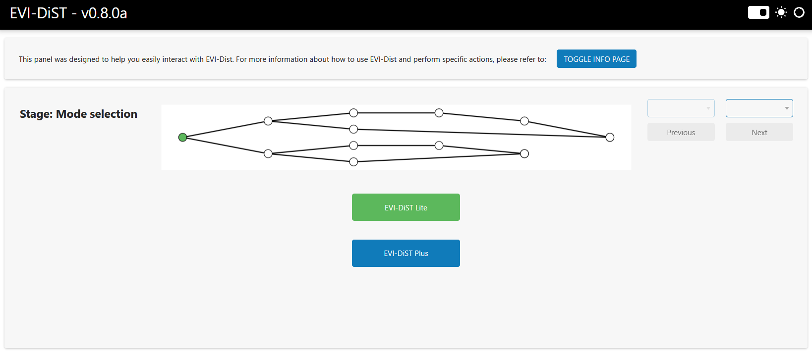
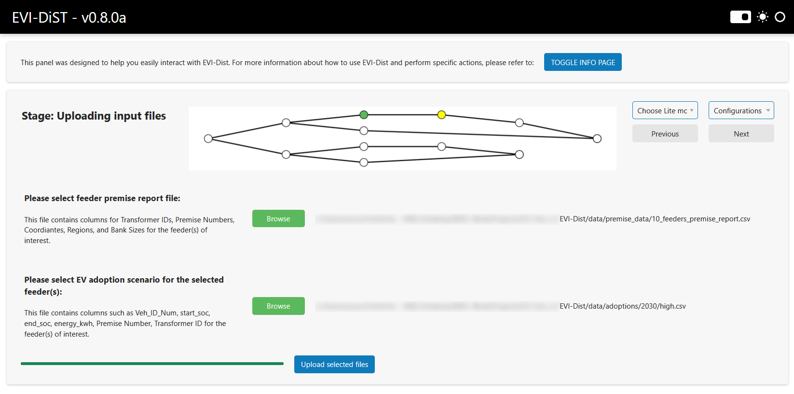
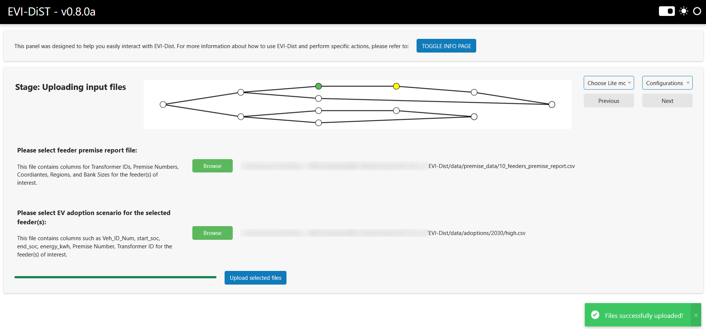
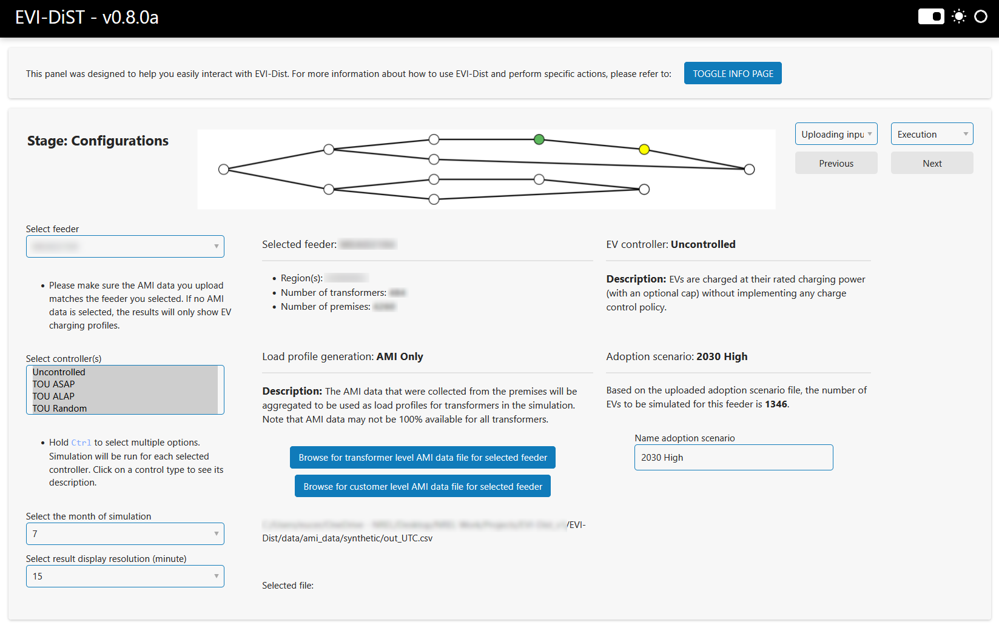
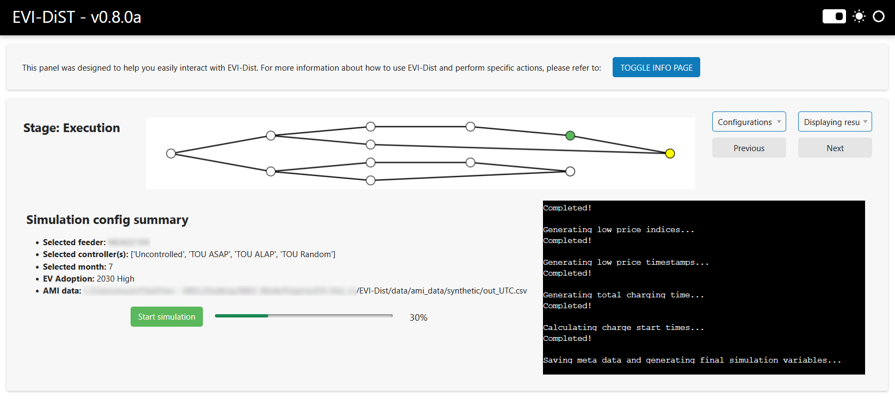
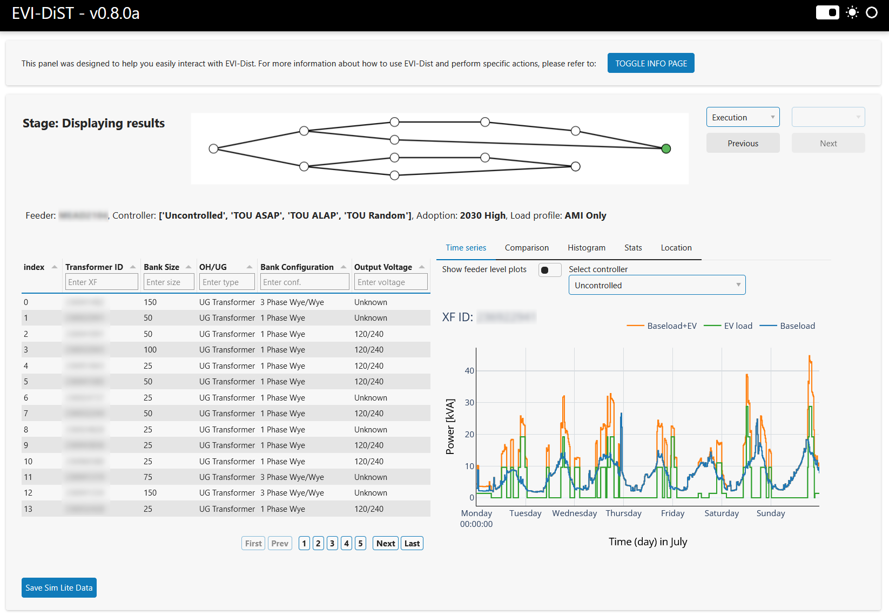
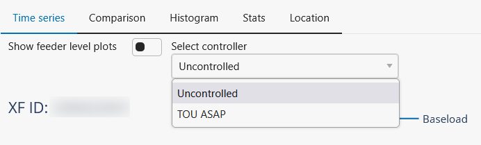
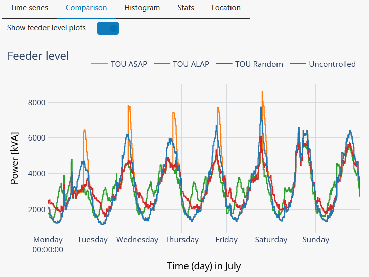
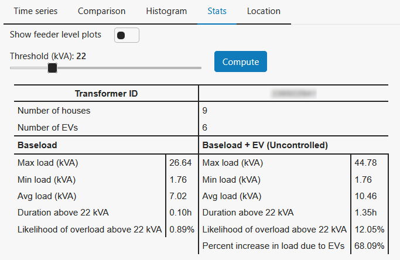

# EVI-DiST v0.8.0a


Electric Vehicle Integration - Distribution Sytem Integration Tool (EVI-DiST) is a co-simulation software platform for modeling, analyzing, and controling grid-scale EV charging integration from primary distribution feeders to secondary circuitry levels.

# Capabilities 
EVI-DiST has the following core capabilities: 
- It provides high-fidelity modeling to utility planners for better monitoring and control of increased EV charging loads within their territory 
- It assesses impact of increasing EV adoption on distribution systems and implements practical control strategies for grid operators to counter expected at scale EV charging load 
- EVI-DiST has a bottom-up modeling approach that includes distributed energy resource (DER) and building load data to provide a clear understanding of non-EV charging base load.
- It allows evaluation of both fixed control methods and methods with real-time grid and/or vehicle feedback and responses 
- It features an interactive web-based dashboard that enhances user interaction and data visualization capabilities. 

EVI-DiST has the following analysis functionalities: 

- Impact on service transformers (e.g., loading, temperature, and degradation) 
- Impact on feeder-level loading 
- Impact on service voltage profiles 
- Descriptive statistics 
- percentage of load reduction with smart charge management (SCM) 
- Comparison of different SCM implementations 

# Getting Started
The recommended way to use EVI-DiST is through the interactive dashboard. After setting up the environment, users can interact with EVI-DiST from their web browser without having to run the code in any IDE. The command line interface and Python interactive notebook examples could be added in future releases.

## Setup
EVI-DiST requires the use of the Anaconda Python distribution. Users who do not use Anaconda will have to install the required packages manually. Refer to `EVI-Dist/environment.yml` for the required packages.

1. After cloning or forking the repository, in the root directory `EVI-Dist/`, run the following command and follow the command line prompts to create a conda environment:
```sh
conda env create -f ./environment.yml
```

2. The created environment will be named `dist`. To activate the conda environment enter the following command:
```sh
conda activate dist
```

3. If all packages successfully installed, see the __Run Instructions__ for how to run an EVI-EnSite simulation.

## Run Instructions
If the installation was successful, the user can immediately run the following code in the `EVI-Dist/` directory to start EVI-Dist. EVI-Dist's dashboard interface will open in the default browser.
```sh
python run.py
```

## How to use

EVI-DiST welcomes you with the following **mode selection** page. As of version 0.8.0a, only the **Lite** version is available. Click **EVI-DiST (Lite)** from the mode selection page.



To start a new simulation, select **Run sim from strach** option. This guide you through the steps to configure, run and view the simulation results. As of version 0.8.0a, you can also load results from a previously run session by selecting the **Load saved simulation files** option. This will skip the setup process and take you directly to the **Displaying results** page, where the saved simulation results are shown.


Upon selecting **Run sim from strach** option, you will get to the **Upload input files** page. Browse and select premise report and EV adoption scenario files. These files are not shipped with EVI-DiST and are usually provided to the user separately. 



Once the files are selected, click on the **Upload selected files** button to extract the vehicle and premise data. After the upload is completed, you'll be prompted with a successful file upload notification. Then click **Next** on the top right.



On the **Configurations** page, select the feeder that you want to run the simulation for. Select the controller type(s), and the month of simulation. If you have **transformer** level AMI data for the selected feeder, browse that file as well. If no AMI data is selected, only EV profiles will be shown. If you additionally have **customer** level AMI for the selected feeder, you can select its file to enable coincidence analysis results in the **Displaying results**  page. Finally, you can custom name the adoption scenario, e.g., 2030 (High).



On the **Execution** page, click the **Start simulation** button and wait for the simulation to complete. Once it is completed, you can click **Next** on the top right.



On the **Display results** page, you can select and observe the loading profiles for each transformer under the selected feeder as well as feeder level profiles.



You can select the controller under the **Time series** tab to see the results for that controller type.



You can see the feeder level load profile results by toggling the **Show feeder level plots** switch.


You can see the comparison results of the selected controllers under the **Comparsion** tab.



You can see the statistical results for each transformer and the selected controller type under the **Stats** tab. Additionally, you can manually change the threshold value and re-compute the stats accordingly. If you already uploaded customer level AMI data file, you can see the coincidence results under the **Stats** tab when **Show feeder level plots** is switched on. 



# Contacts
For questions or more information, please contact: 

* Emin Ucer: Emin.Ucer@nrel.gov
* Nadia Panossian: Nadia.Panossian@nrel.gov
* Derek Jackson: Derek.Jackson@nrel.gov
* Erik Pohl: Erik.Pohl@nrel.gov
* Mingzhi Zhang: Mingzhi.Zhang@nrel.gov
