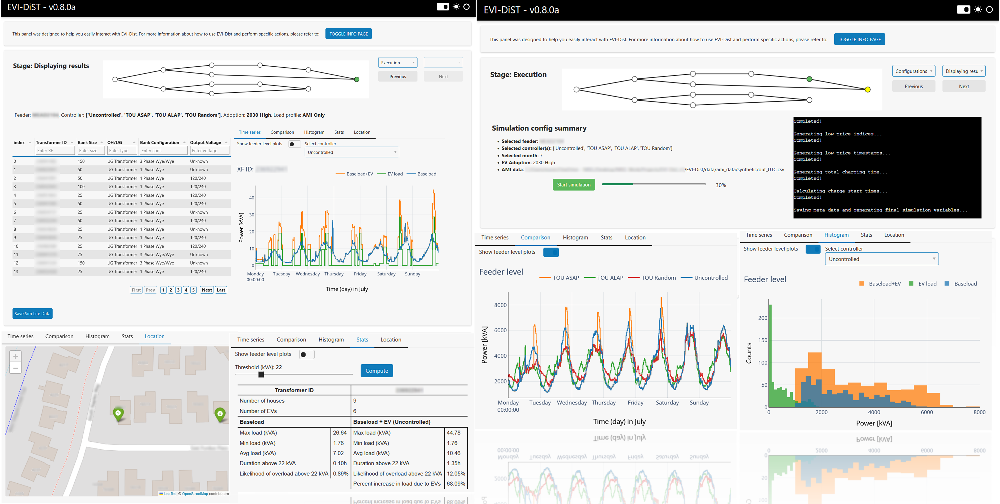
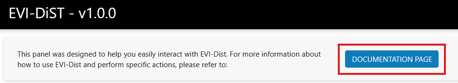

# EVI-DiST v1.0.1



Electric Vehicle Integration - Distribution System Integration Tool (EVI-DiST) is a co-simulation software platform for modeling, analyzing, and controling grid-scale EV charging integration from primary distribution feeders to secondary network levels.

# Capabilities 
EVI-DiST has the following core capabilities: 
- It provides high-fidelity modeling to utility planners for better monitoring and control of increased EV charging loads within their territory 
- It assesses impact of increasing EV adoption on distribution systems and implements practical control strategies for grid operators to counter expected at scale EV charging load 
- EVI-DiST has a bottom-up modeling approach that includes distributed energy resource (DER) and building load data to provide a clear understanding of non-EV charging base load.
- It allows evaluation of both fixed control methods and methods with real-time grid and/or vehicle feedback and responses 
- It features an interactive web-based dashboard that enhances user interaction and data visualization capabilities. 

EVI-DiST has the following analysis functionalities: 

- Impact on service transformers (e.g., loading, temperature, and degradation) 
- Impact on feeder-level loading 
- Impact on service voltage profiles 
- Descriptive statistics 
- percentage of load reduction with smart charge management (SCM) 
- Comparison of different SCM implementations 

# Getting Started
You can access all installation and usage details of EVI-DiST on the documentation page: https://pages.github.nrel.gov/AVCI/EVI-Dist/

# Installation 

The recommended way to use EVI-DiST is through the interactive dashboard. After setting up the environment, users can interact with EVI-DiST from their web browser without having to run the code in any IDE. The command line interface and Python interactive notebook examples could be added in future releases.

## Setup
EVI-DiST requires the use of the Anaconda Python distribution. Users who do not use Anaconda will have to install the required packages manually. Refer to `EVI-Dist/environment.yaml` for the required packages.

1. After cloning or forking the repository, in the root directory `EVI-Dist/`, run the following command and follow the command line prompts to create a conda environment:
```sh
conda env create -f ./environment.yaml
```

2. The created environment will be named `dist`. To activate the conda environment enter the following command:
```sh
conda activate dist
```

3. If all packages successfully installed, see the __Run Instructions__ for how to run an EVI-EnSite simulation.

## Run Instructions
If the installation was successful, the user can immediately run the following code in the `EVI-Dist/` directory to start EVI-Dist. EVI-Dist's dashboard interface will open in the default browser as shown in Figure below.
```sh
python run.py
```


## Accessing documentation locally
You can also access the documentation locally (after installation) by clicking the `DOCUMENTATION PAGE` button at the top of the page shown below.



# Contacts
For questions or more information, please contact: EVI-DiST@nrel.gov