# EVI-DiST Lite
This page guides you through the steps to run a simulation using EVI-DiST Lite

## 1. Mode Selection
When you start **EVI-DiST** by running `python run.py`, it welcomes you with the following **mode selection** page. Click `EVI-DiST Lite` button to get started with **the Lite** version.
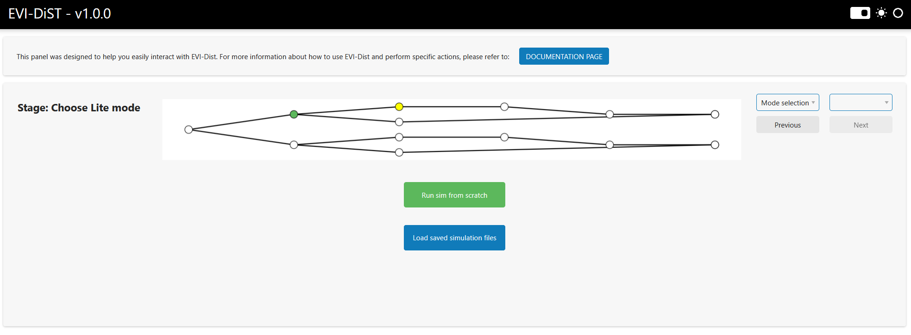

## 2. New Sim or Load Session
After selecting **EVI-DiST Lite**, you will be directed to a page where you can choose to start a new simulation or load a previously saved simulation file. You will have the option to save the simulation results after the simulation is completed (refer to **Load simulation files** section from the navigation list). Click **Run sim from scratch** option to run a new simulation. 
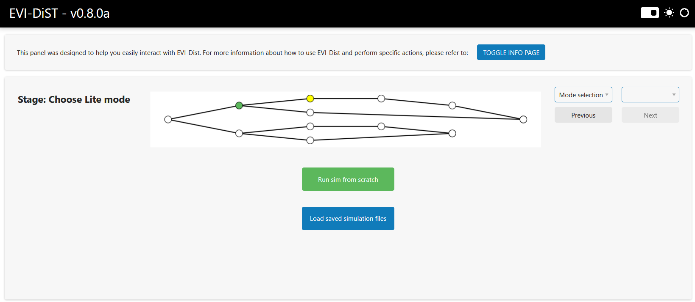

## 3. Uploading Input Files
**EVI-DiST Lite** mainly requires at least three input files: **premise report file**, **EV adoption file**, and **AMI data file(s)**. On the following page, you are requested to upload the premise report and EV adoption files. Descriptions of these files are listed below.

- **Premise report file**: This csv file should contain columns related to transformer and premise information such as `Feeder`, `Premise Number`, `Longitude_X`, `Latitude_Y`, `Community`, `OG/UG`, `Transformer ID`, `Bank Size`, `Bank Configuration`, `Output Voltage`. An example of a premise report csv file is shown below.
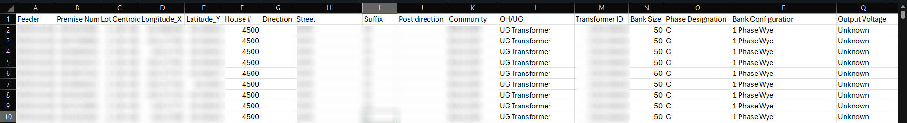

- **EV adoption file**: This csv file should contain columns related to EV charging events such as `Veh_ID_Num`, `park_start_timestamp`, `park_end_timestamp`, `park_time_seconds`, `energy_kwh`, `start_soc`, `end_soc`. An example of an EV adoption csv file is shown below.
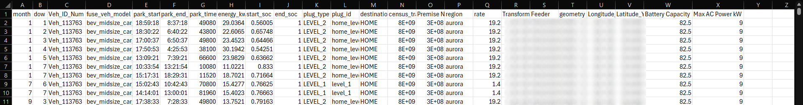

Once you upload the necessary files, click the `Upload selected files` button. EVI-DiST will extract and process the uploaded files and prompt a success message in the lower-right corner as follows. The `Next` button in the upper-right should now be enabled, allowing you to proceed to the next page by clicking it.

## 4. Simulation Configurations
The **Configurations** page allows for setting important simulation parameters. The feeders extracted from the premise report are listed in the drop down list and can be selected to perform simulations. Once the feeder is selected, its details are displayed in the middle column under **Selected feeder** section. 

**EVI-DiST** offers several controller options: 

- No smart charging control: `Uncontrolled`

- TOU-based controllers: `TOU ASAP`, `TOU ALAP`, and `TOU Random`

- Grid-aware controllers: `FCFS`, `FCFS + SM`, and `Equal Sharing`

(**TOU**: Time of use, **FCFS**: First come first served, **SM**: Supply minimum)

More than one controller options can be selected by holding `Ctrl` key to run simulations. Description of each controller option is shown in the far-right column under **EV controller** section. 

The simulation month and display resolution can also be selected from the drop-down lists. Note that the performance of displaying the results may be affected by the chosen resolution.
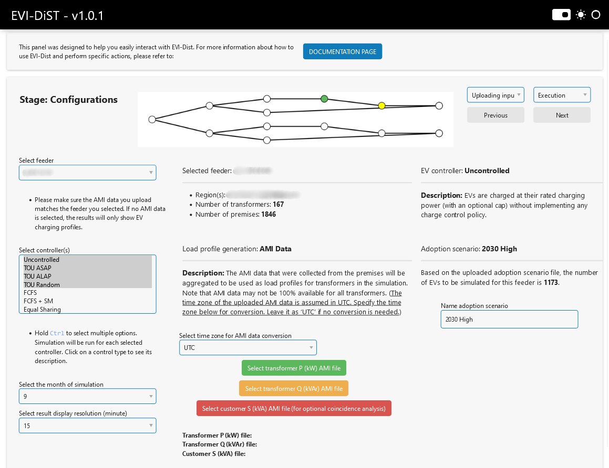
 <ins>Transformer level</ins> active (P-kW) and reactive (Q-kWAr) power AMI data files are required to generate the simulation’s baseload. Please select AMI files with columns representing transformer ID numbers. Note that the uploaded AMI data file should match the selected feeder. An example of an AMI file is shown below.
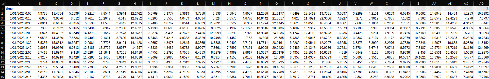
> **EVI-DiST** also offers an optional coincidance analysis if <ins>customer level</ins> AMI data is available. This analysis is not required to run simulations, but can be performed alongside the base simulation if a <ins>customer level</ins> AMI file is uploaded using the red button labeled **Select customer S (kVA) file (for optional coincidance analysis)**. You need to upload a **.pkl** file that contains the customer level AMI profiles (either S or P) for the selected feeder and month. (Make sure you always select the **Uncontrolled** controller option to run the coincidence analysis.)

EVI-DiST Lite assumes the AMI data is provided in the UTC time zone. If the feeder to be simulated is located in a different time zone, the AMI data timestamps should be converted to the target time zone to ensure accurate alignment of EV charging events with the baseload. The desired time zone can be selected from a drop-down list. If the AMI data is already in the feeder's time zone, no conversion is necessary, and the time zone option can remain set to "UTC".
 
Finally, a custom name can be given to the adoption scenario to help identify and distinguish it from other scenarios. After configuring the settings, you can click `Next` to proceed to the next page.

## 5. Running Simulations
The **Execution** page is where you can see the selected simulation configurations, start running the simulation, and monitor the execution progress. Once the simulations are completed, you can proceed to the **Display results** page. 
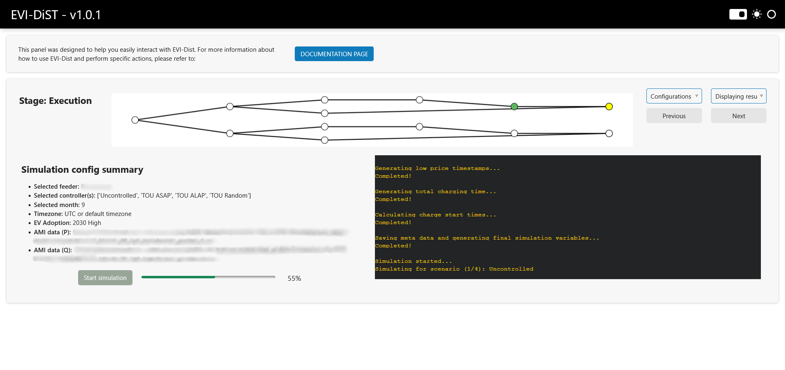

## 6. Displaying Results
The **Display Results** page is the final step in EVI-DiST, allowing you to view and interact with the simulation outcomes. The table on the left lists the transformer IDs in the selected feeder, along with key details such as the number of premises and EVs associated with each transformer, as well as the maximum overload percentage across the chosen controller options. You can click any transformer ID from the table and its associated profiles are shown on the right. You can save the simulation results by clicking the **Save Sim Lite Data** button in the lower-left corner. The results will be compressed into a zip file and downloaded shortly.
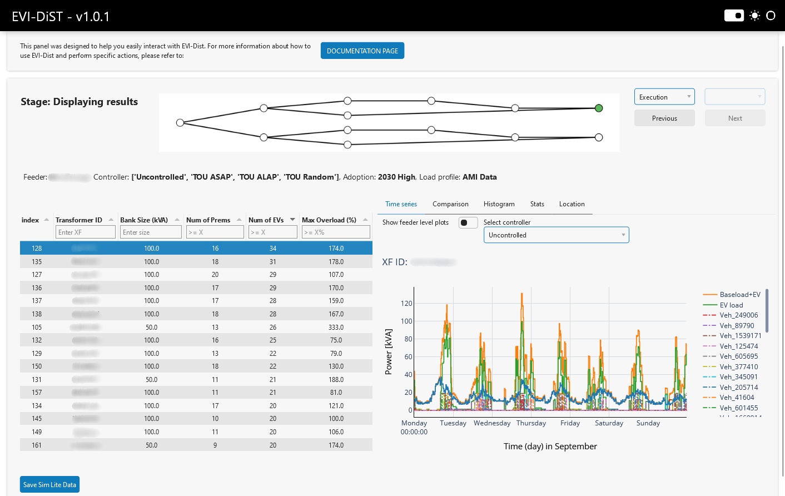
By default, the time series plots display the **Baseload**, **EV Load**, and **Baseload + EV** profiles, along with individual EV profiles associated with the selected transformer and controller option. To view results for a different controller, simply select it from the dropdown menu. Additionally, you can toggle individual traces on or off by clicking their names in the legend.
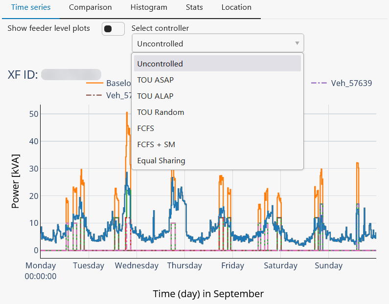

Alternatively, you can see the results of different controllers together for the selected transformer under the **Comparison** tag for comparison.
 
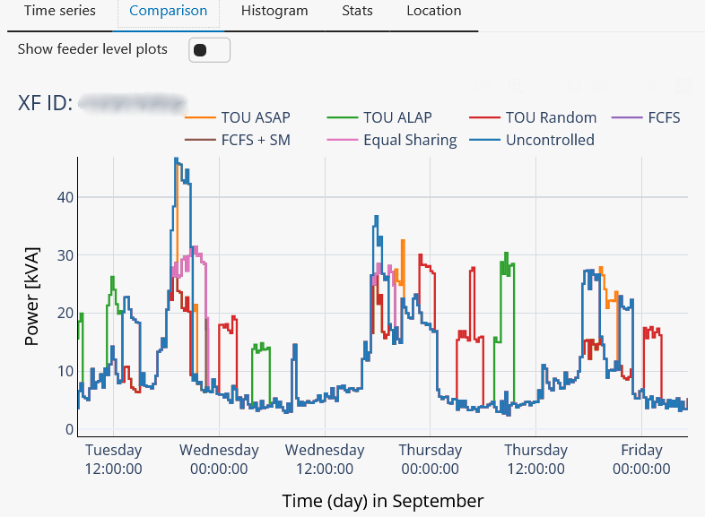

The **Histogram** tag shows the power distribution of the **Baseload**, **EV Load**, and **Baseload + EV** profiles for the selected controller.
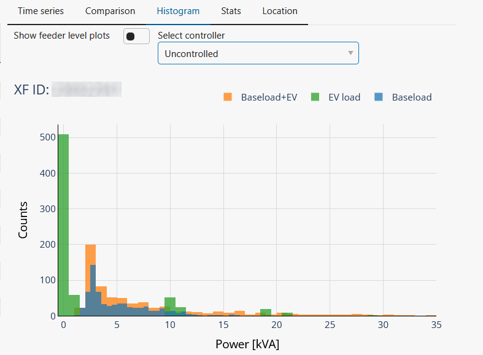

The **Stats** tab provides key statistics and quantitative insights on the transformer's loading for the selected controller, compared to the baseline case. The **Threshold (kVA)** slider represents the transformer's rated power and allows you to explore how its loading would vary with different rating values.

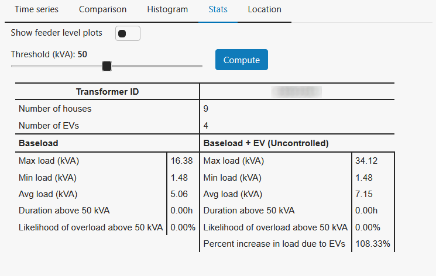

The **Location** tab displays the geographic location of the selected transformer on a map.
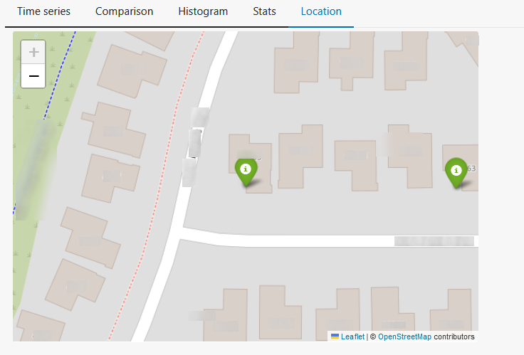

If you toggle the **Show feeder level plots** switch, the **Time series**, **Comparison**, and **Histogram** tabs will show the feeder level power profiles instead of transformer level. You can select the controller from the drop down list to see the results associated with it. 

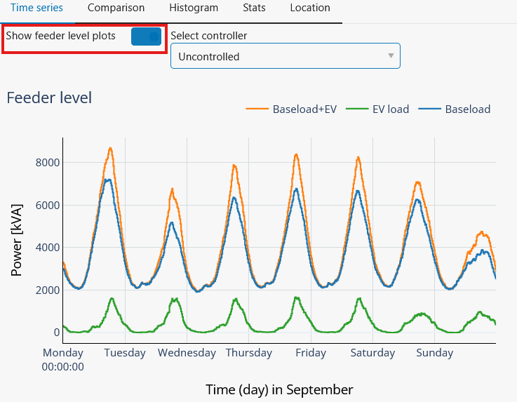

If you previously uploaded **Customer-Level AMI Data** on the **Configurations page**, the **Stats** tab will display the Coincidence Analysis Results for the selected controllers.

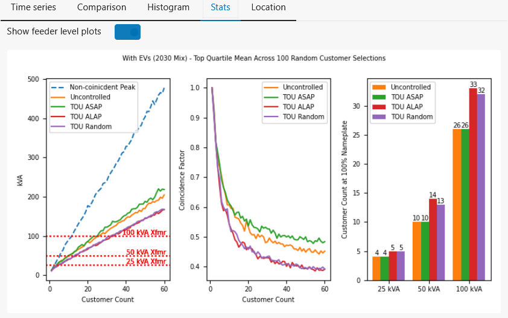

## 7. Load Simulation Files
If you previosly saved the simulation files, you can load them back without having to run the simulations again by clicking the **Load saved simulation files** button on the **Choose Lite mode** page.
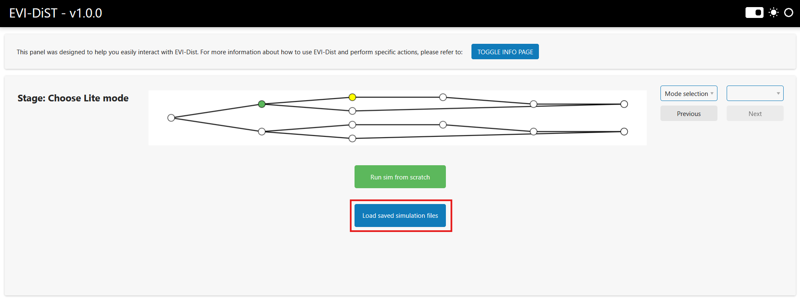

On the **Load Session** page, browse to select the generated zip file containing the compressed simulation files, then click the **Upload Selected Files** button. Once the files are successfully uploaded, a green notification will appear, and you can click Next to proceed. This will take you directly to the **Displaying Results** page.
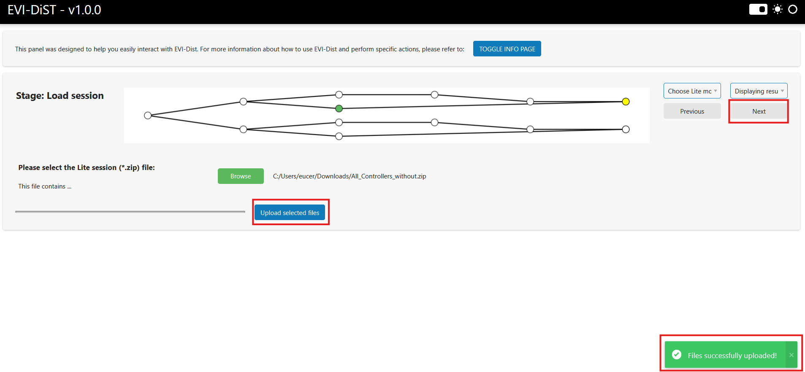