# EVI-DiST Plus
This page guides you through the steps to run a simulation using EVI-DiST Plus.

---

## 1. Mode Selection
When you start **EVI-DiST** by running `python run.py`, it welcomes you with the following **mode selection** page. Click `EVI-DiST Plus` button to get started with **the Plus** version.

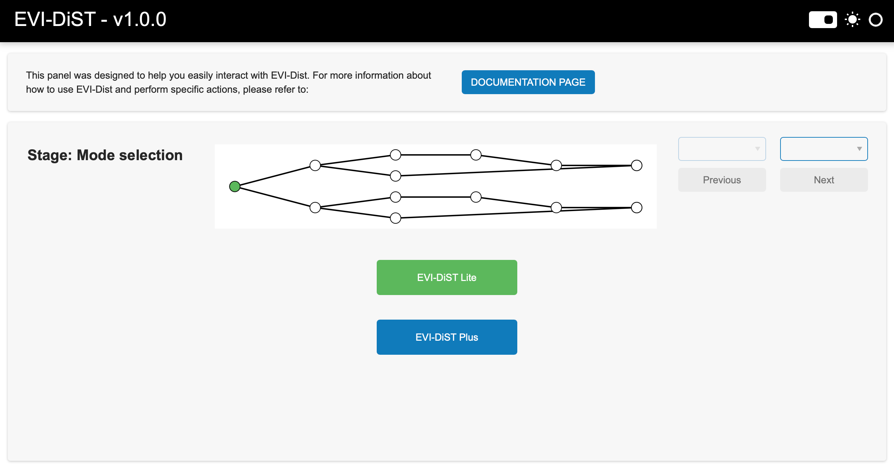

---

## 2. Run a New Sim or Load Session
After selecting **EVI-DiST Plus**, you will be directed to a page where you can choose to start a new simulation or load a previously saved simulation file. You will have the option to save the simulation results after the simulation is completed (refer to **Load simulation files** section from the navigation list). Click **Run sim from scratch** option to run a new simulation.

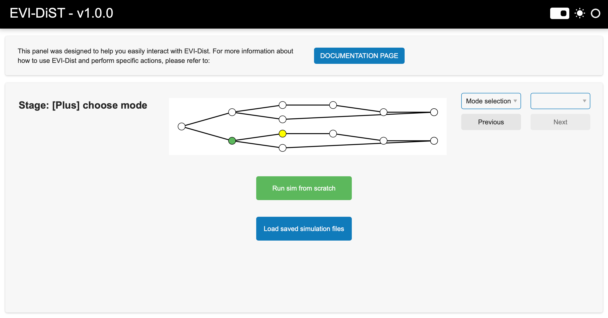

### 2a. Load Simulation Files
To load a previously saved simulation file, click **Browse** and select the saved session `.zip` file. The default directory to load Plus mode simulation files from is `/EVI-Dist/data/saved_sessions_plus/`. Once the file is selected, click **Upload selected files** and wait until a banner pops up confirming the files were loaded successfully. Then click **Next**, which will skip directly to the **Displaying Results** page.

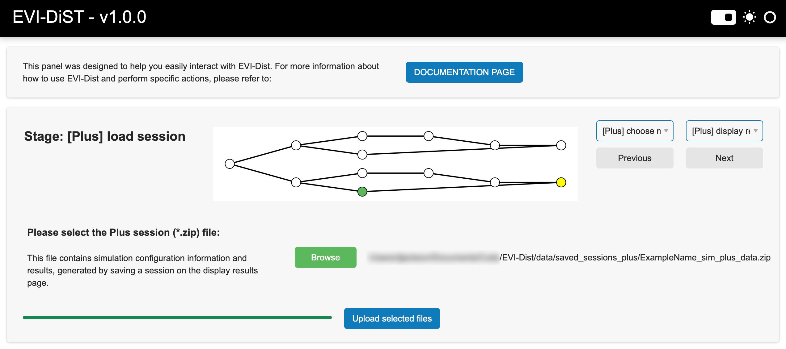

---

## 3. Uploading Input Files
**EVI-DiST Plus**  requires three input files: **main OpenDSS file**, **premise report file**, and **EV adoption file**. The default directories to load these files from are `/EVI-Dist/inputs/opendss_model`, `/EVI-Dist/data/premise_data`, `/EVI-Dist/data/adoptions`, respectively. Each file is explained below.

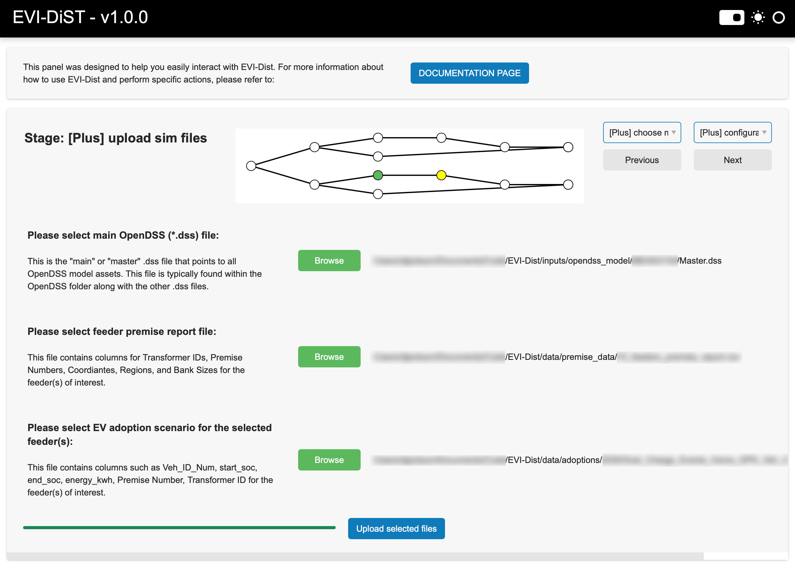

- **OpenDSS main file**: OpenDSS models are typically defined using multiple files, all stored in the same directory. OpenDSS loads a model using the **main OpenDSS file** (named `Master.dss` in this guide and the figure above) references each `.dss` file within the same directory as `Master.dss`. The OpenDSS model will also contain a set of loadshapes assigned to different nodes to represent base residential loads.

- **Premise report file**: The **premise report file** primarily provides mapping between service transformers and premise numbers, which allows EV charging loads to be properly injected into the openDSS simulation.
This csv file should contain columns related to transformer and premise information such as `Feeder`, `Premise Number`, `Lot Centroid`, `Longitude_X`, `Latitude_Y`, `Community`, `OG/UG`, `Transformer ID`, `Bank Size`, `Bank Configuration`, `Output Voltage`. An example of a premise report csv file is shown below.

- **EV adoption file**: The **EV adoption file** contains all the EV charge events for the simulation. The location that EV charging loads are modeled within the OpenDSS simulation is determined by the premise numbers. In the event that the assigned premise number does not have an associated node within the OpenDSS model, the EV charging load is directly connected to the assigned service transformer.
This csv file should contain columns related to EV charging events such as `Veh_ID_Num`, `Premise Number`, `Transformer ID`, `park_start_timestamp`, `park_end_timestamp`, `park_time_seconds`, `energy_kwh`, `start_soc`, `end_soc`. An example of an EV adoption csv file is shown below.

Once you select the necessary files, click the `Upload selected files` button. EVI-DiST will extract and process the uploaded files and prompt a success message in the lower-right corner as follows. The `Next` button in the upper-right corner should now be enabled, allowing you to proceed to the next page by clicking it.

---

## 4. Simulation Configuration
After the simulation input files are selected and successfully loaded, you can proceed to the configuration page. There are 5 fields to fill out:

1. `Enter simulation name`: enter a custom name for the simulation, including any details you'd like to specify.
2. `Select the month of simulation`: choose the month that EV charging events in **EV adoption file** will be filtered by. The available months come from the **EV adoption file**.
3. `Select the day of week of simulation`: choose the day of week that EV charging events in **EV adoption file** will be filtered by.
4. `Select feeder`: choose the feeder that EV charging events in **EV adoption file** will be filtered by. **NOTE**: be sure that the selected feeder name matches the feeder that the **main OpenDSS file** is for, otherwise the simulation will not properly model EV charging.
5. `Select control`: choose the EV charging controller to use in the simulation. When a controller is selected, a text box to the right of the controller list will provide details on the controller. The available controllers are `Uncontrolled`, `TOU ASAP`, `TOU ALAP`, `TOU Random`, `Equal Sharing`, `FCFS`, and `FCFS + SM50`. **EVI-DiST Plus** only supports selecting a single controller for simulation.

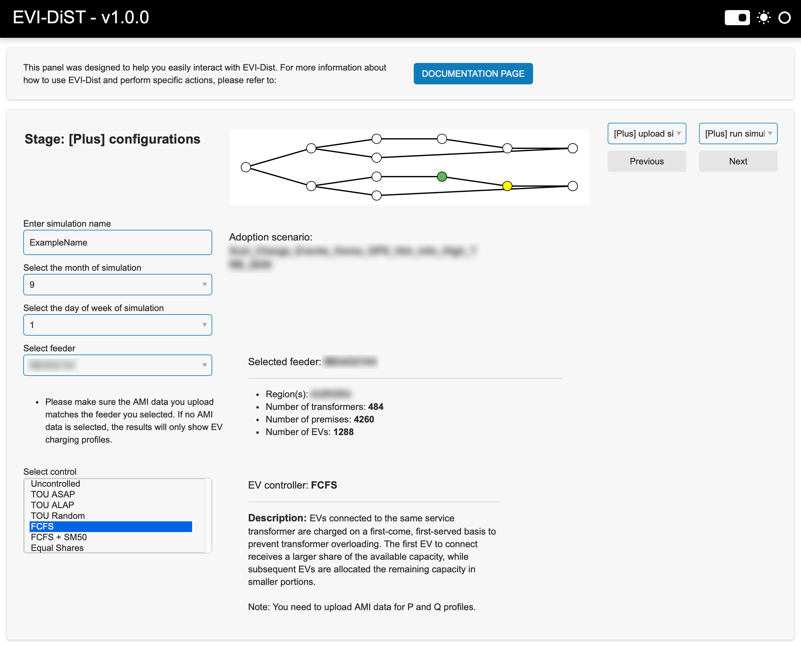

Once the simulation is configured, proceed to the next page by clicking the `Next` button.

---

## 5. Running the Simulation
Begin running the simulation by clicking the `Start simulation` button. A progress bar and the simulation terminal will provide feedback on the status of the simulation.

**EVI-DiST Plus** co-simulation consists of three components all managed through a **Helics broker** : **Grid sim**, **Controller sim**, and **Charging sim**. The simulation is preset to run a 24-hour simulation with a 5-minute resolution, starting at 06:00 AM.

The simulation terminal will display when each co-simulation completes. After each co-simulation is complete the simulation data must be processed. This may take some time depending on your computer. You will know when you can proceed to the next page when the terminal prints out "Simulation data processed." and the `Next` button in the upper-right corner is enabled.

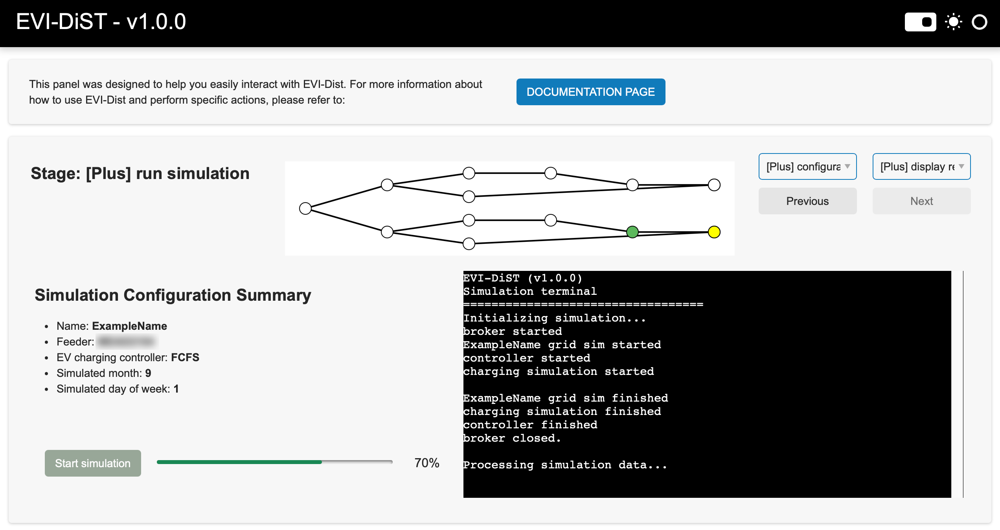

---

## 6. Displaying Results
Simulation results can be viewed and analyzed on this page. You either reached this page after running a simulation or loaded simulation results as discussed in **Section 2a**. At the top of the page is a button to save simulation results. **Simulation results will not be saved unless you manually save them**. After clicking the `Save Simulation Results` button, wait a little bit for a dialog window to pop up to choose the name and directory to save the simulation results `.zip` file.
There is also a button to open a new tab session, so multiple simulations can be compared side-by-side. Refer to **Section 7** for more information.

This display results page is organized into 5 sections: **Simulation information summary**, **Transformer Loading Summary**, **Lines Loading Summary**, **PCC Bus Voltage Summary**, and **Analyze Individual Elements**. Each section can be collapsed per the user's preference. Continue reading for information on each section.

The **Simulation information summary** displays key simulation information to provide context on the results being displayed, including the **EV charging controller**. Within this section, information on the feeder and the simulation results are given. This includes the **number of transformers** within the feeder network, **number of premises**, **total number of EVs** being charged by the feeder network, and the **ratio of EV charge events** that were completed during the simulation (which is subject to the charging controller). **NOTE**: the **total number of EVs** is based on the number of EVs that had a charging event within the simulated month and day, NOT every EV that is charged by the feeder network in the charge events file. Additionally, a charge event is NOT counted in the **ratio of EV charge events** metric if its charging session continues beyond the simulation time.

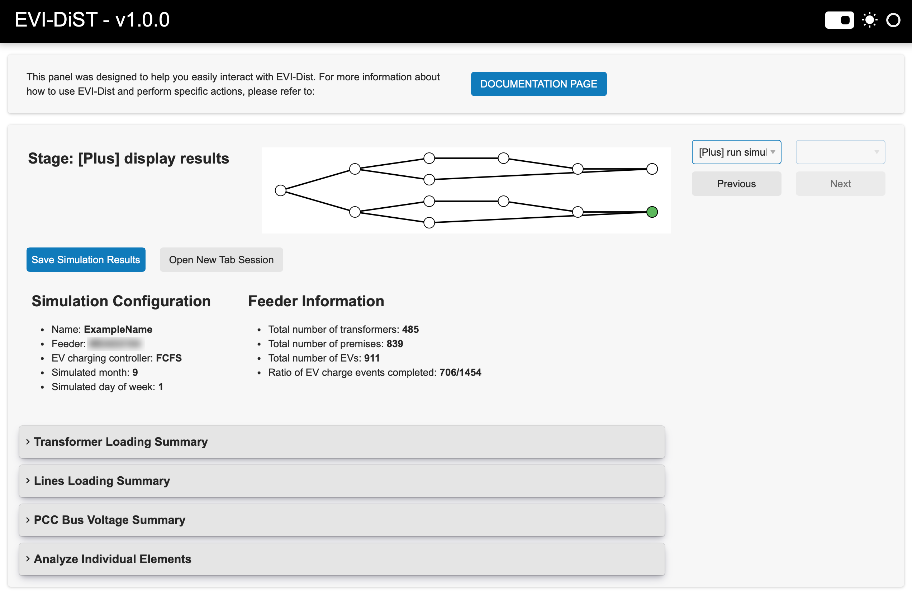

### 6a. Transformer Loading Summary
This section provides a summmary of the transformer kVA overloads within the feeder network. A bar graph displays the total number of transformers within the feeder network (in blue) and the total number of overloaded transfomers (in red), catagorized by their kVA rating. A list of the overloaded transformer names and ratings is displayed to the left of the bar graph. You can read or copy a transformer name to then view more detailed information in the **Analyze Individual Elements** section below.

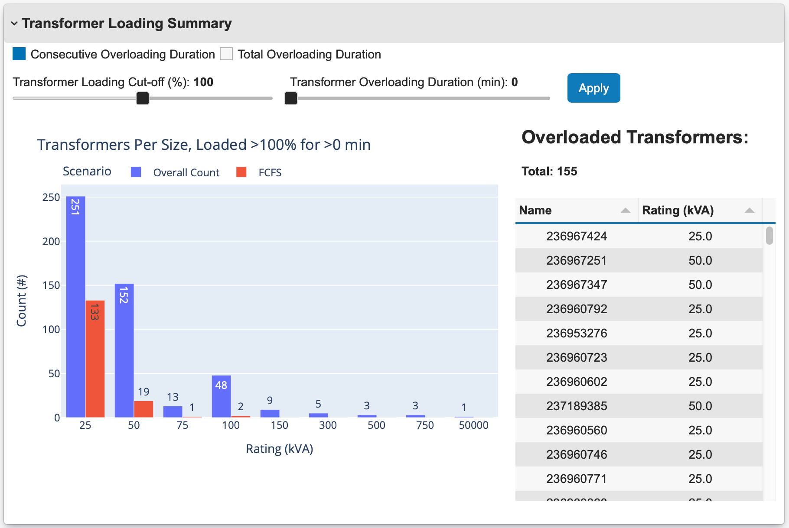{: style="height:75%;width:75%"}

There are three tuning parameters for the transformer overloading bar graph and table:

1. Toggle between `Consecutive Overloading Duration` or `Total Overloading Duration`:
    - `Consecutive Overloading Duration`: a transformer is considered overloaded if it **consistently and consecutively** spends time exceeding the loading % cut-off for the defined duration. For example, consider a 100% loading cut-off for a 30 minute duration. A transformer **WOULD NOT** be considered overloaded if it was loaded for 15-min at 100%, followed by 15-min at 90%, followed by 15-min at 100% again.
    - `Total Overloading Duration`: a transformer is considered overloaded if it spends a **total combined** time exceeding the loading % cut-off for the defined duration. For example, consider a 100% loading cut-off for a 30 minute duration. A transformer **WOULD** be considered overloaded if it was loaded for 15-min at 100%, followed by 15-min at 90%, followed by 15-min at 100% again.
2. The `Transformer loading Cut-off (%)` determines the cut-off point, defined as a percentage of its kVA rating, in which a transformer is considered overloaded. Adjusting this value can provide insight on the severity of transformer overloads in this feeder network.
3. The `Transformer Overloading Duration (min)` determines the time that a transformer must spend exceeding the loading cut-off % for it to be considered overloaded. Adjusting this value can provide insight on the severity of transformer overloads in this feeder network. When `Transformer Overloading Duration (min): 0`, the overloading duration defaults to a single step size of the simulation (i.e., 5-min).
4. When the desired tuning parameters are selected, press the `Apply` button for the bar graph and table to be updated.

### 6b. Lines Loading Summary
This section provides a summmary of the distribution line Ampere overloads within the feeder network. A bar graph displays the total length (in miles) of lines within the feeder network (in blue) and the total length (in miles) of overloaded lines (in red), catagorized by their line codes. A list of the overloaded line names and ratings is displayed to the left of the bar graph. Primary and secondary lines are summarized separately. You can read or copy a line name to then view more detailed information in the **Analyze Individual Elements** section below.

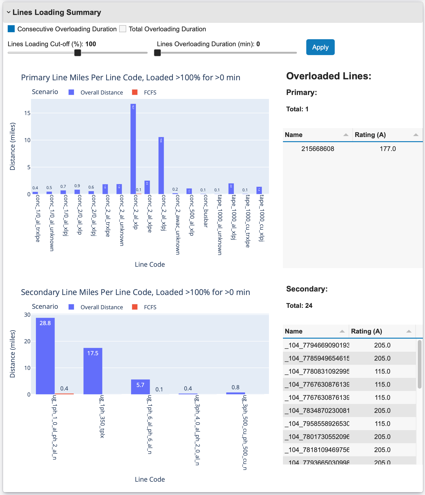{: style="height:75%;width:75%"}

There are three tuning parameters for the line overloading bar graphs and tables:

1. Toggle between `Consecutive Overloading Duration` or `Total Overloading Duration`:
    - `Consecutive Overloading Duration`: a line is considered overloaded if it **consistently and consecutively** spends time exceeding the loading % cut-off for the defined duration. For example, consider a 100% loading cut-off for a 30 minute duration. A line **WOULD NOT** be considered overloaded if it was loaded for 15-min at 100%, followed by 15-min at 90%, followed by 15-min at 100% again.
    - `Total Overloading Duration`: a line is considered overloaded if it spends a **total combined** time exceeding the loading % cut-off for the defined duration. For example, consider a 100% loading cut-off for a 30 minute duration. A line **WOULD** be considered overloaded if it was loaded for 15-min at 100%, followed by 15-min at 90%, followed by 15-min at 100% again.
2. The `Lines loading Cut-off (%)` determines the cut-off point, defined as a percentage of its Ampere rating, in which a line is considered overloaded. Adjusting this value can provide insight on the severity of line overloads in this feeder network.
3. The `Lines Overloading Duration (min)` determines the time that a line must spend exceeding the loading cut-off % for it to be considered overloaded. Adjusting this value can provide insight on the severity of line overloads in this feeder network. When `Lines Overloading Duration (min): 0`, the overloading duration defaults to a single step size of the simulation (i.e., 5-min).
4. When the desired tuning parameters are selected, press the `Apply` button for the bar graph and table to be updated.

### 6c. PCC Voltage Summary
This section provides a summary of the voltage minimums of the PCC buses within the feeder network. A histogram displays the distribution of the minimum voltage of all PCC buses. The minimum voltage considers each phase of the bus. A list of PCC buses that had a voltage below the user-defined minumum for a user-defined duration is displayed to the left of the histogram. You can read or copy a bus name to then view more detailed information in the **Analyze Individual Elements** section below.

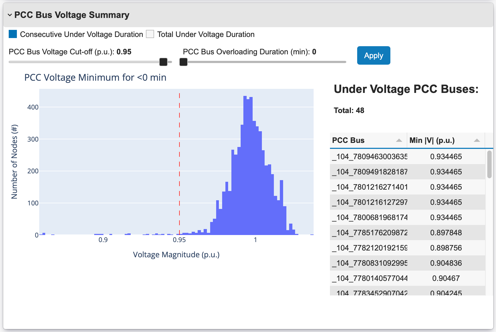{: style="height:75%;width:75%"}

There are three tuning parameters for the PCC bus under voltage histogram and table:

1. Toggle between `Consecutive Overloading Duration` or `Total Overloading Duration`:
    - `Consecutive Under Voltage Duration`: a bus is considered under voltage if it **consistently and consecutively** spends time below the per-unit voltage limit for the defined duration. For example, consider a per-unit voltage limit of 0.95 for a 30 minute duration. A bus **WOULD NOT** be considered under voltage if it was loaded for 15-min at 100%, followed by 15-min at 90%, followed by 15-min at 100% again.
    - `Total Under Voltage Duration`: a bus is considered under voltage if it spends a **total combined** time exceeding the per-unit voltage limit for the defined duration. For example, consider a per-unit voltage limit of 0.95 for a 30 minute duration. A bus **WOULD** be considered under voltage if it was loaded for 15-min at 100%, followed by 15-min at 90%, followed by 15-min at 100% again.
2. The `PCC Bus Voltage Cut-off (p.u.)` determines the cut-off point, defined as per unit of its rated voltage, in which a bus is considered under voltage. Adjusting this value can provide insight on the severity of bus under voltage in this feeder network. **NOTE**: this cut-off value does not affect the histogram distribution, only the table of PCC buses that had under voltage. This limit is visualized on the histogram plot as a dotted vertical line at the selected per-unit voltage value.
3. The `PCC Bus Overloading Duration (min)` determines the time that a bus must spend exceeding the loading cut-off % for it to be considered overloaded. Adjusting this value can provide insight on the severity of bus under voltage in this feeder network. When `PCC Bus Overloading Duration (min): 0`, the overloading duration defaults to a single step size of the simulation (i.e., 5-min).
4. When the desired tuning parameters are selected, press the `Apply` button for the bar graph and table to be updated.

### 6d. Analyze Individual Transformer
One of the three tabs within the **Analyze Individual Elements** section allows you to view details on specific transformer within the Feeder network.
The table here lists the following details of each transformer, where each column can be filtered using the select/text-box below the headers:

- `Name (ID)`: the name assigned to the transformer. This will match the names in the list of overloaded transformers in the **Transformer Loading Summary** section. You can filter for a specific transformer or for a subset of transformers that have similar names by entering the transformer name in the `== X` textbox.
- `Rating (kVA)`: the power rating of the transformer in kVA. You can filter for a subset of transformers with a certain power rating(s) using `<select>` dropdown list.
- `Max Load Power (pu)`: the maximum load supplied by the transformer as a percentage of its power rating. Entering a percentage value in the `>= X%` textbox will filter the list of transformers that had a max load power greater than the specified value.
- `Avg Load Power (pu)`: the average load supplied by the transformer as a percentage of its power rating. Entering a percentage value in the `>= X%` textbox will filter the list of transformers that had an avg load power greater than the specified value.
- `Min Load Power (pu)`: the minimum load supplied by the transformer as a percentage of its power rating. Entering a percentage value in the `>= X%` textbox will filter the list of transformers that had a min load power greater than the specified value.
- `Phases (#)`: the number of output (LV side) phases of the transformer. The `<select>` dropdown list will filter the list of transformers to match the number(s) of phases selected.
- `Premises (#)`: the number of premises that this transformer supplies. You can filter transformers that have a mimimum number of premises using the `>= X` textbox.
- `EVs (#)`: the number of EVs that had a charging event supplied by this transformer. **NOTE**: this does not tell you the TOTAL number of EVs that charge using this transformer based on the input charge event file. It will only tell you the number of EVs that had a charging event during the simulation month and day. Selecting a different day and month may result in a different number of EVs. You can filter transformers that have a minimum number of premises using the `>= X` textbox.
- `Charge Events Completed (%)`: the percentage of charge events that completed during the simulation. This number does not count charging sessions that continue past the end of the simulation. You can filter transformers that have a maximum number of charge events completed using the `<= X` textbox.

Clicking on a transformer row in the table will select that transformer and a time series plot of its load power magnitude will be displayed below the table. It's baseload, the combined EV charging load, and the indivdual charging profiles of each EV are shown as traces. This graph is interactive and a subset of power profiles can be selected, or the graph can be zoomed in for better detail.

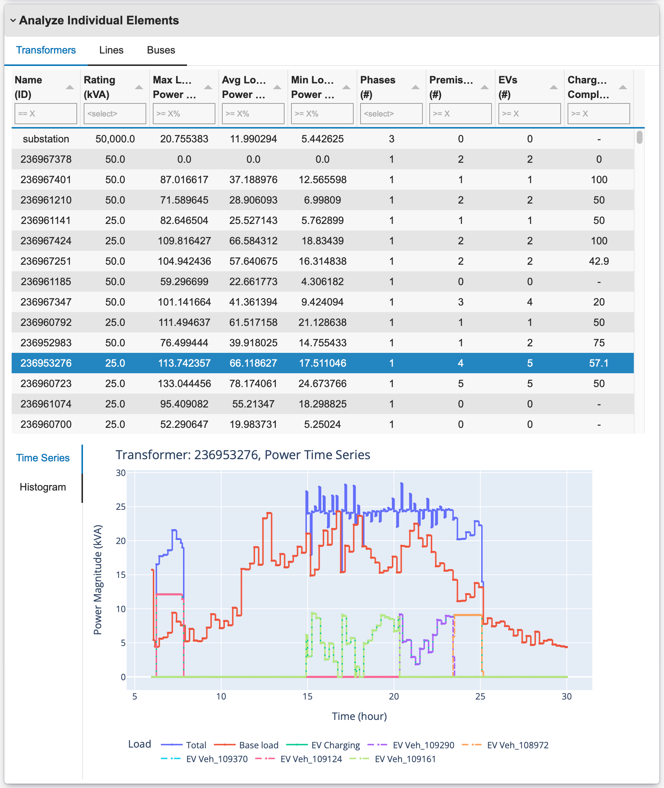{: style="height:75%;width:75%"}

By default the `Time Series` tab is open, which displays the power time series. You can view the transformer loading power histogram by clicking the `Histogram` tab. This plot shows the total duration (in hours) the transformer spent at a specific kVA load level.

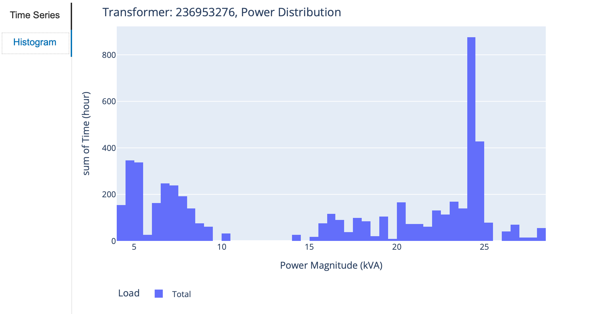{: style="height:60%;width:60%"}

### 6e. Analyze Individual Lines
One of the three tabs within the **Analyze Individual Elements** section allows you to view details on specific distriubtion lines within the Feeder network.
The table here lists the following details of each line, where each column can be filtered using the select/text-box below the headers:

 - `Name (ID)`: the name assigned to the distribution line. This will match the names in the list of overloaded lines in the **Lines Loading Summary** section. You can filter for a specific line or for a subset of lines that have similar names by entering the line name in the `== X` textbox.
 - `Type (str)`: specifies whether this line is part of the primary or secondary distribution network. Filter for the type using the `<select>` dropdown list.
 - `Line Code (str)`: the assigned line code within the OpenDSS model. Filter for a specific line code(s) using the `<select>` dropdown list.
 - `Length (kft)`: the length of the distribution line in thousands of feet. Filter for a minimum line length using the `>= X` textbox.
 - `Phases (#)`: the number of phases of the line. The `<select>` dropdown list will filter the list of lines to match the number(s) of phases selected.
 - `Rating (A)`: the max current rating of the line in Amperes. Filter for a minimum current rating using the `>=X` textbox.
 - `Max Load (pu)`: the maximum load through the line as a percentage of its current rating. Entering a percentage value in the `>= X%` textbox will filter the list of lines that had a max load current greater than the specified value.
 - `Avg Load (pu)`: the average load through the line as a percentage of its current rating. Entering a percentage value in the `>= X%` textbox will filter the list of lines that had an avg load current greater than the specified value.
 - `Min Load (pu)`: the minimum load through the line as a percentage of its current rating. Entering a percentage value in the `>= X%` textbox will filter the list of lines that had a min load current greater than the specified value.

Clicking on a line row in the table will select that line and a time series plot of its load current magnitude will be displayed below the table. Each individual phase current is shown as traces. This graph is interactive and a subset of line phases can be selected, or the graph can be zoomed in for better detail.

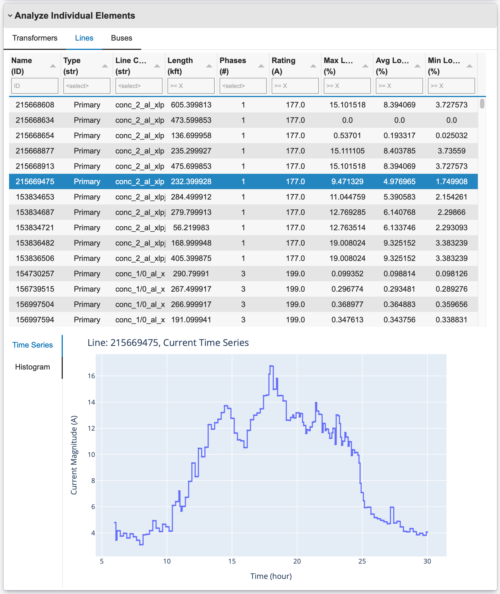{: style="height:75%;width:75%"}

By default the `Time Series` tab is open, which displays the current time series. You can view the line loading current histogram by clicking the `Histogram` tab. This plot shows the total duration (in hours) the line spent at a specific current load level.

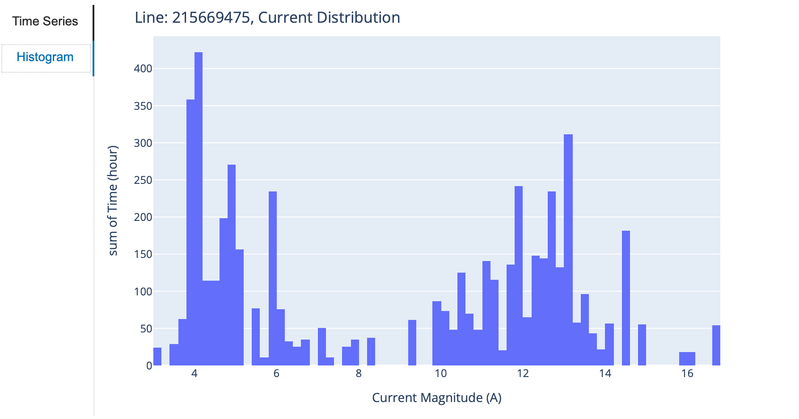{: style="height:60%;width:60%"}

### 6f. Analyze Individual Buses
One of the three tabs within the **Analyze Individual Elements** section allows you to view details on specific buses within the Feeder network.
The table here lists the following details of each bus, where each column can be filtered using the select/text-box below the headers:

 - `Bus (ID)`: the name assigned to the bus. This will match the names in the list of undervoltage buses in the **PCC Bus Voltage Summary** section. You can filter for a specific bus or for a subset of buses that have similar names by entering the bus name in the `== X` textbox.
 - `Is PCC (Y/N)`: specifies whether this bus is a PCC. Filter for where it is a PCC using the `<select>` dropdown list.
 - `Phases (#)`: the number of phases of the bus. The `<select>` dropdown list will filter the list of buses to match the number(s) of phases selected.
 - `Min |V| (p.u.)`: the minimum voltage of the bus in per unit. Entering a per unit value in the `>= X%` textbox will filter the list of buses that had a min voltage greater than the specified value.
 - `Avg |V| (p.u.)`: the average voltage of the bus in per unit. Entering a per unit value in the `>= X%` textbox will filter the list of buses that had an avg voltage greater than the specified value.
 - `Max |V| (p.u.)`: the maximum voltage of the bus in per unit. Entering a per unit value in the `>= X%` textbox will filter the list of buses that had a max voltage greater than the specified value.

Clicking on a bus row in the table will select that bus and a time series plot of its voltage magnitude will be displayed below the table. Each individual bus phase voltage is shown as traces. This graph is interactive and a subset of bus phases can be selected, or the graph can be zoomed in for better detail.

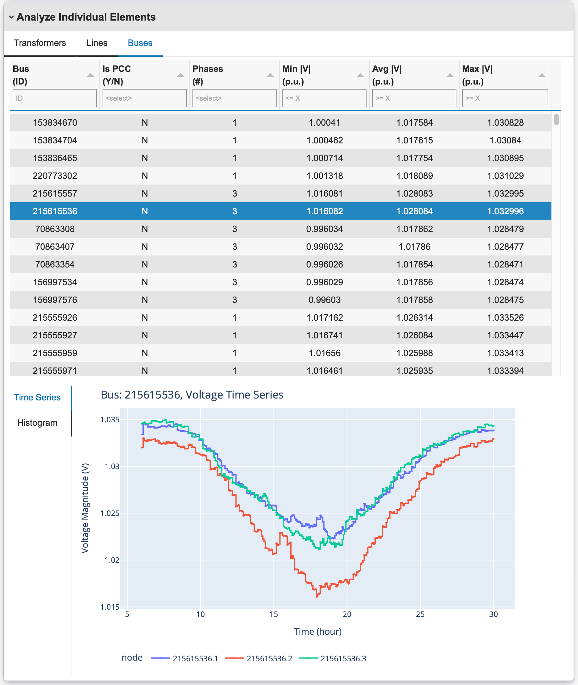{: style="height:75%;width:75%"}

By default the `Time Series` tab is open, which displays the power time series. You can view the bus voltage (p.u.) histogram by clicking the `Histogram` tab. This plot shows the total duration (in hours) the bus spent at a specific voltage level.

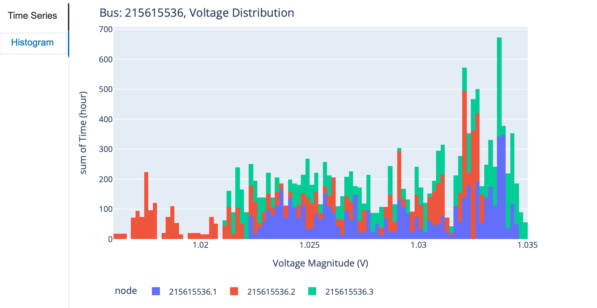{: style="height:60%;width:60%"}

---

## 7. Comparing Multiple Simulation Runs
While a single instance of the **Display Results** page only supports viewing the results of a single simulation, it is possible to perform a side-by-side comparison of different simulations by opening the secondary results in another tab. Clicking the `Open New Tab Session` button opens a new browser tab to the main page of **EVI-DiST**. Follow the steps outlined in this guide to load previous simulation results from a `.zip` file. You can splitscreen the two open **Display Results** pages, as shown in the screenshot below, to view and compare the results.

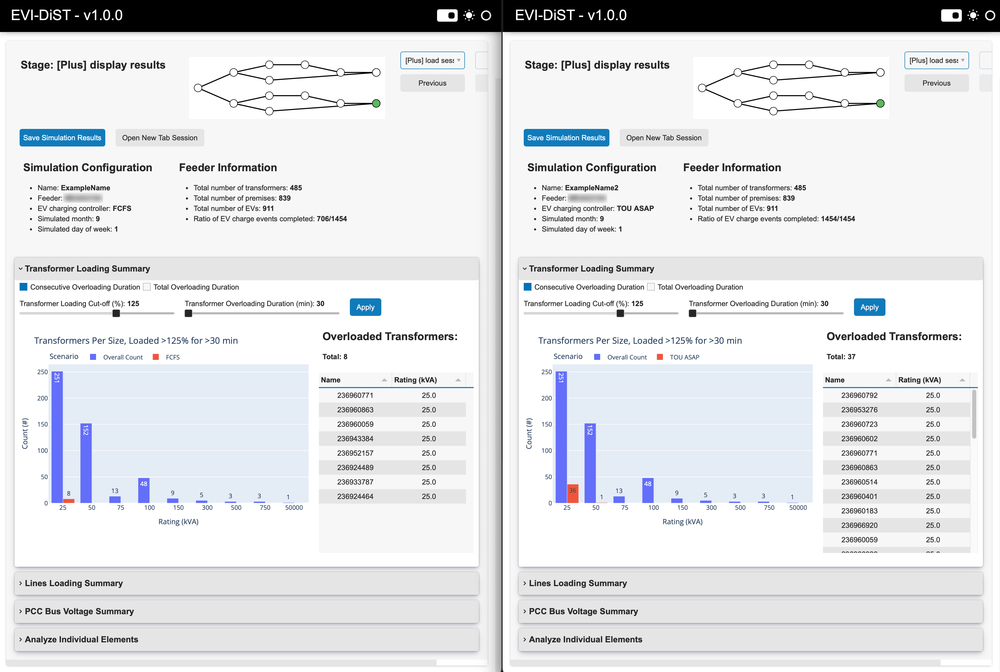